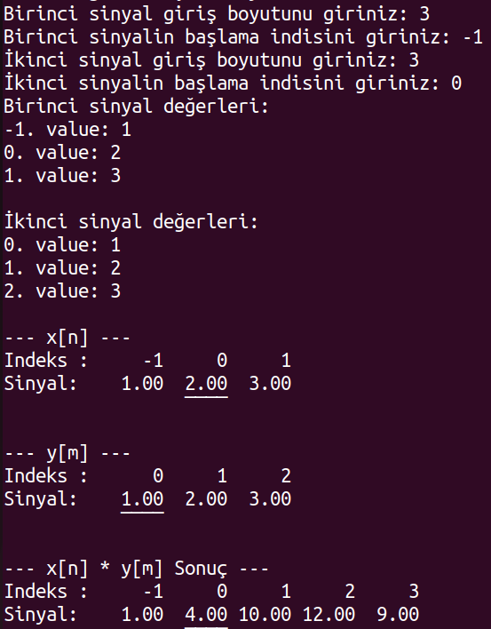
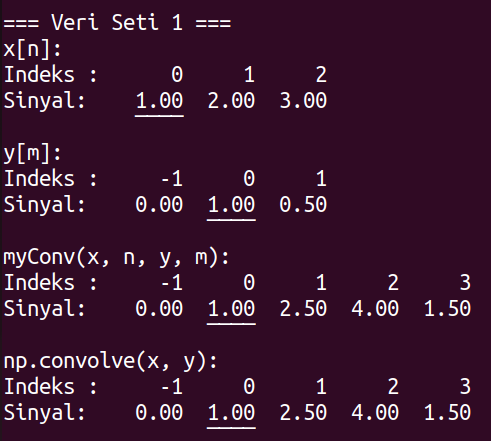
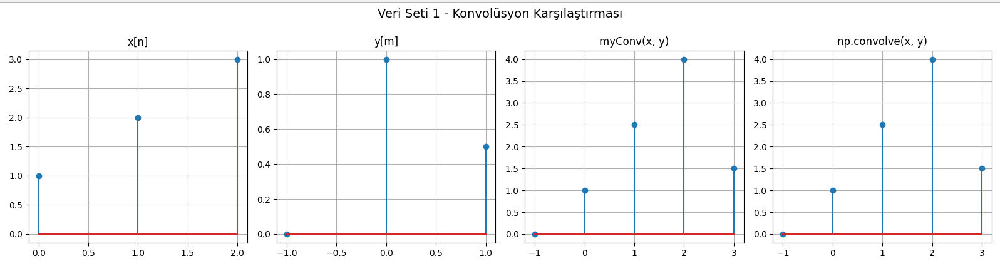
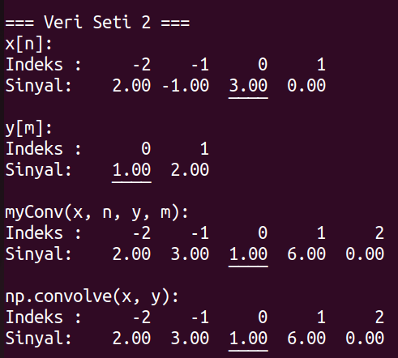
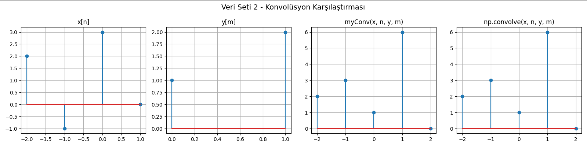
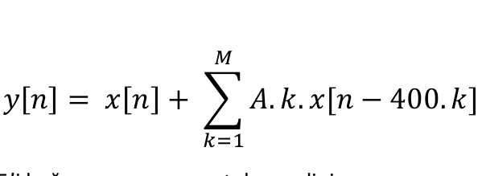

# BLM2041 – Signals and Systems for Computer Engineers  
## Assignment 1 Report  
**Student Name:** Mert Çolpan  

---
## 🚀 How to Clone and Run the Project

**Clone the repository and navigate into it:**

   ```bash
   git clone https://github.com/mertColpan/convolution_with_sound.git
   cd convolution_with_sound
   python3 convolution.py


## 1. Custom Convolution Function – `myConv(x, n, y, m)`

### 1.1 Function Description
The custom `myConv(x, n, y, m)` function simulates the convolution process manually. The parameters are:

- `x`: First signal  
- `n`: Length of the first signal  
- `y`: Second signal  
- `m`: Length of the second signal  

The function performs convolution using a basic multiplication approach. To optimize runtime, the indices and values of the impulse signal where values are non-zero are extracted and used in the convolution, especially when many values are zero.

The function is designed to ignore the starting index when calculating the result, as it does not affect the final convolution output. Index values for the resulting signal are calculated outside the convolution function.

### 1.2 Test Case

**Input Signals:**  
- `x[n] = [1, 2, 3]`  
- `y[n] = [1, 2, 3]`  

**Expected Output:** `[1, 4, 10, 12, 9]`  
**Actual Output:** 

---

## 2. Comparison: Built-in vs Custom Function

### 2.1 Dataset 1

- `x[n] = [1, 2, 3]`  
- `y[n] = [0, 1, 0.5]`  

**Expected Output:** `[0, 1, 2.5, 4, 1.5]`


#### 2.1.1 Vector Comparison


#### 2.1.2 Plots  


---

### 2.2 Dataset 2

- `x[n] = [2, -1, 3, 0]`  
- `y[n] = [1, 2]`  

**Expected Output:** `[2, 3, 1, 6, 0]`

#### 2.2.1 Vector Comparison  


#### 2.2.2 Plots  


---

## 3. Voice Recordings

Voice recordings were performed using the `sounddevice` library in Python.

- **Sampling Rate:** 44100 samples/sec  
- **Recording Durations:**  
  - First recording: 5 seconds  
  - Second recording: 10 seconds  

The recorded files were named `X1` and `X2`. Informational messages were displayed before and after each recording. A 5-second pause was added between the recordings.

---


## 4. Convolution on Voice Signals

### 4.1 System Equation

The system is defined by the following equation:




Where:  
- `A = 0.5`  
- `M = [3, 4, 5]`  

### 4.2 Impulse Response

To apply convolution, the impulse response of the system is derived as:


### 4.3 Implementation Notes

The audio recorded using the `sounddevice` library was in 2D format (n, 1), which caused issues during convolution. To fix this, the signal was reshaped to a 1D array before convolution. Before playback, it was reshaped back into 2D to avoid errors.

Both `myConv()` and the built-in `np.convolve()` were used for each value of `M`. All resulting signals, along with the input signal, were played back.

### 4.4 Graphs and System Interpretation

The system applies an echo effect by delaying the input signal by multiples of 400 samples.  

**Delay in seconds:**  

400 / fs = 400 / 44100 ≈ 0.009 seconds


- The number of echoes depends on the value of `M`.  
- Increasing `M` adds more delayed copies of the original signal.  
- Each echo is scaled by `A * k`, making later echoes louder.

Although the sample count doubles due to longer recording time, the impulse signal remains unaffected because it only depends on delay and `M`.

There is a strong similarity between the outputs of the manual and built-in convolution functions, with only minor edge-case differences. This validates the correctness of the custom `myConv()` function.

---

## 5. Conclusion

The project demonstrated a successful implementation of a custom convolution function, tested against multiple datasets and real audio signals. Echo effects were created based on a system equation using impulse responses, and all functionalities were verified using both visual plots and audio playback.

---

## 📎 Figures and Recordings

Place all generated plots and sound files in the `img/` folder and other appropriate directories. Update image paths as necessary.


